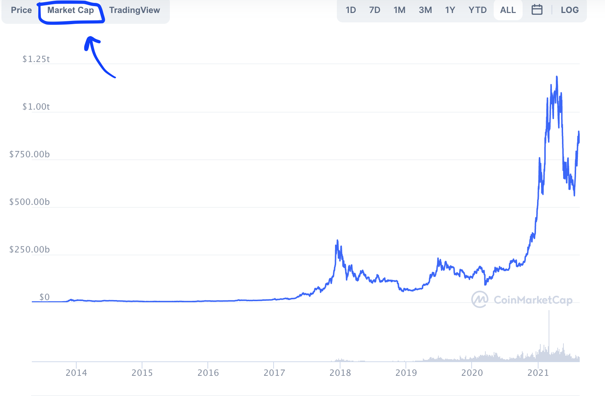
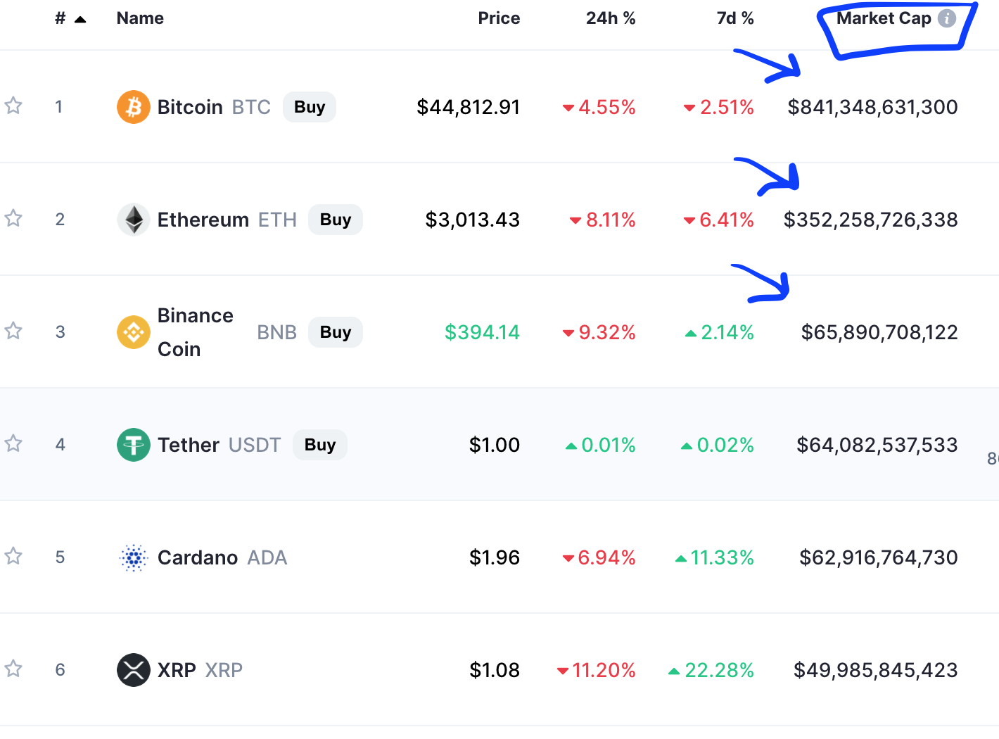
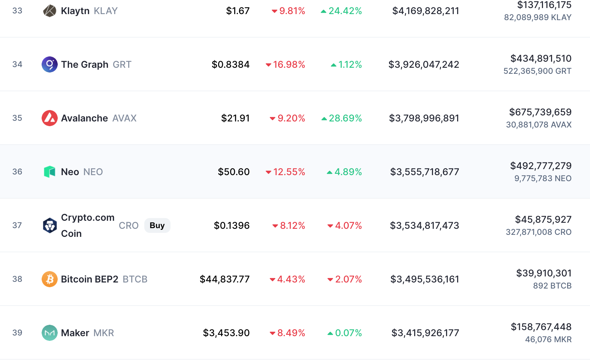
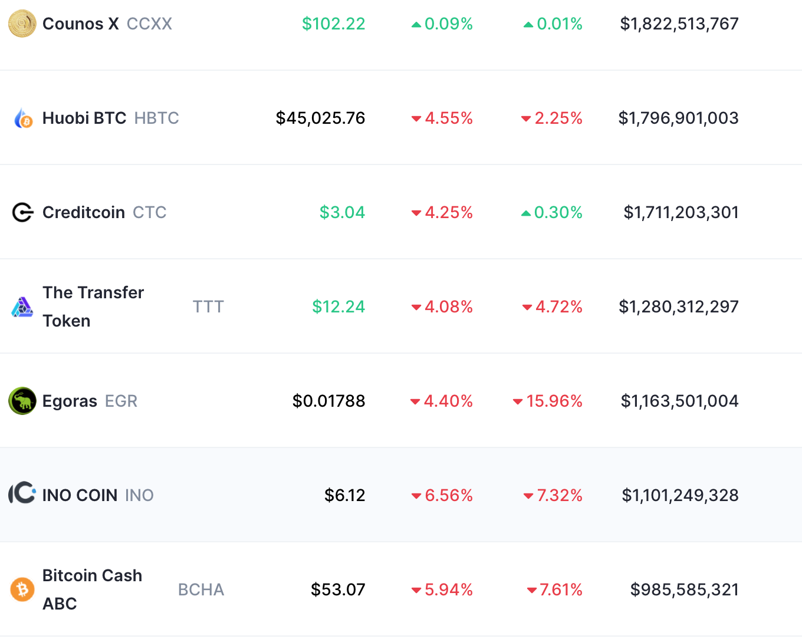

# Market Capitalization

## Indicator Overview

Within the financial industry, market capitalization is the total dollar value of the company's current share price and the total number of outstanding stocks.

In crypto, market cap \(or MCAP\) refers to the aggregate valuation of the cryptocurrency based on its current price and the total number of that crypto asset in existence, calculated by multiplying the total circulating supply with its last traded price.

$$
Market Capitalization = Circulating Supply * Current Price
$$


For instance, a token with 30 billion circulating supply selling at $3 a coin would have a market cap of $90 billion.


## How can I use it?

Understanding what a token is worth and the ranking of its relative size in the market is a fundamental task for traders. 

### Classify the size of a crypto asset

Given its visuality and simplicity for value measurement and risk assessment of crypto assets, the market cap can be a helpful metric in estimating which tokens you favored.

Comparing the relative size of one token versus another, you can easily divide cryptos into three categories: large-caps, mid-caps, and small-caps.

* [x] Large-cap cryptos generally have a market capitalization of $10 billion and more. 

These giants have usually been around for a long time\(such as Bitcoin, Ethereum\), or they are often dominant players in a specific emerging ecosystem\(like Unisawp token, Binance token\).


Consequently, investments in large-cap cryptos may be considered more relatively safe than investments in small-cap or mid-cap cryptos, generally posing less risk in trading for less aggressive rewards.


* [x] Mid-cap cryptos typically have a market capitalization of between $1 billion to $10 billion.

These cryptos are established projects that have the potential to snowball over time, but many of them may come and go bankrupt within years.


As a result, investing in mid-cap cryptos probably brings huge returns in a short period, but be careful; these cryptos also carry higher risks than the large-caps.


* [x] Small-cap cryptos are generally those with a total value of less than $1 billion.

These tokens or coins could represent young and startup projects that account for the most significant proportion of cryptocurrencies in the market.


Unfortunately, small-cap cryptos are considered high-risk investments due to their lack of liquidity, centralized holders ,and other dangerous uncertainties characteristics. 


However, it also refers to a much bigger room for growth potential as this particular crypto is likely still in the process of development stages.

In conclusion, risk and reward go hand in hand. When considering whether to invest in large-caps or small-cap cryptos, you should assess your risk appetite and then build a mixed cryptocurrency portfolio diversification.

### Example application based on MCAP

For further example, there is a case for newcomers to plan a fundamental diversification that can reduce potential risk, applying knowledge of MCAP.

Suppose you have an amount of money to start a crypto investment, and the initial step is looking for target assets that can achieve your financial goals. In that case, you should never put all your eggs in one basket. An alternative and intelligent portfolio would distribute capital into different sizes of cryptocurrencies to minimize risk, depending on market capitalization classes _\(e.g., $10000 budget in total, $5000 for large-caps, $4000 for mid-caps, $1000 for small-caps.\)_

| Market Cap | Risk Classes | Potential Returns | Long Position |
| :--- | :--- | :--- | :--- |
| Large-caps | Low | Low | $5000 |
| Mid-caps | Mid | Mid | $4000 |
| Small-caps | High | High | $1000 |

## Further Resources

Read more to learn how to diversify your portfolio:

\(PS: link below for example only, we can add blog relevant articles when product launching \)



## Variations



## Link to our data

* View Market Cap in Candlestick Analytics
* View Market Cap in API Docs

