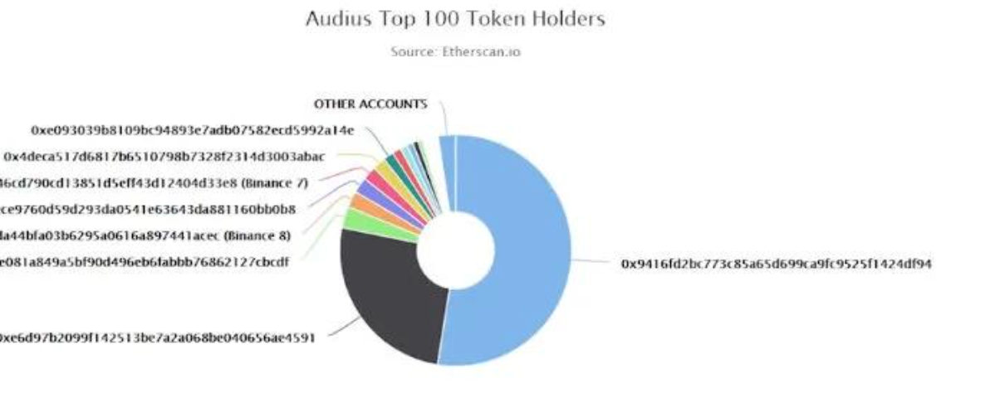
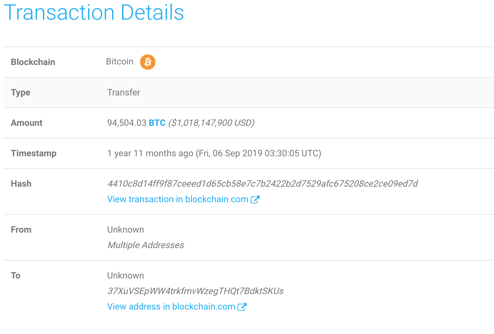
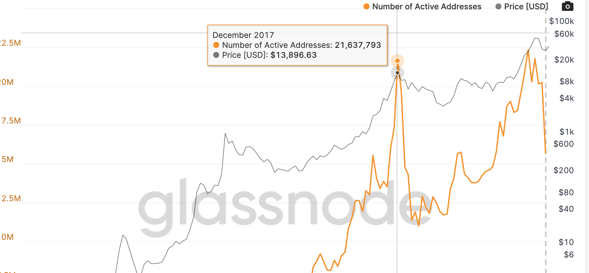

# Track Whale Dumping

Entities who hold a vast number of coins of a particular cryptocurrency are known as whales that could be institutions or individuals in the crypto market. 

As the concentration of wealth, Whales can be a problem that creates volatility or decreases liquidity for a specific cryptocurrency. 


For example, if whales put massive sell orders on the market to sell coins for currency, the panic selling they generated could put downward pressure on the price. 


There are some suggested indicators to monitor whale dumping on the blockchain:

## Top Balance

The top balance pie chart in Candlestick is helpful as it can show you whether there are just a few wallets holding most of the supply of a particular coin or token. 

If a few holders heavily concentrate the supply of coins, there would be a considerable risk that one of these whales could start to sell, which would dump the price.



## Top Transactions

Candlestick provides this indicator to estimate the large on-chain transaction to help you check the possibility of whale dumping. 

When you figure out a big deal is happening from a personal wallet address to an [exchange,](www.cctv.com) this might mean the whale who sent a specific cryptocurrency wants to sell it.



## Active Addresses

Another indicator that could benefit the whale tracker is the active addresses. Suppose there are wallet-exchange transactions from an ancient whale address sleeping for ages. In that case, it could be a signal suggested that the price of a particular cryptocurrency has achieved a high level that even the hardcore holders are awaked for selling.



## Link to our data

* View live charts in Candlestick Analytics

